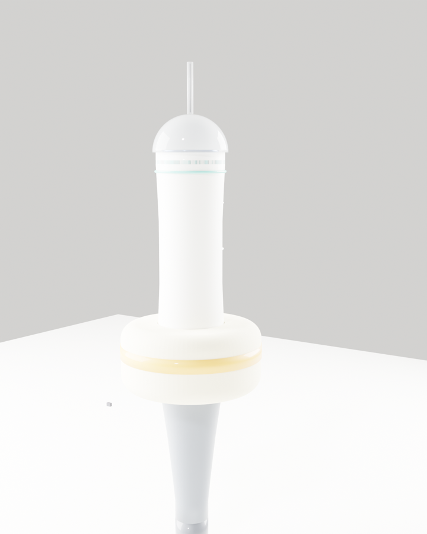
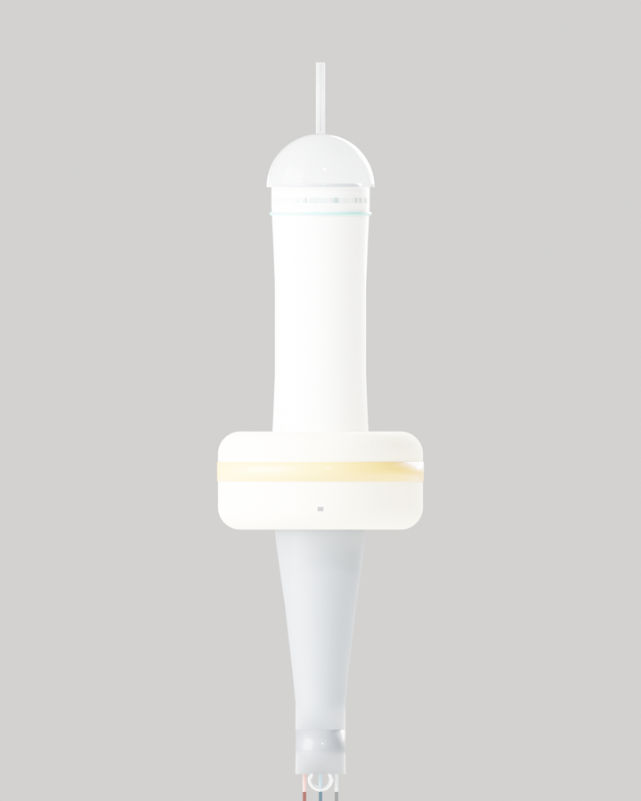
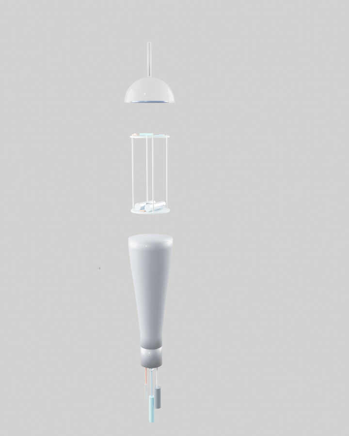

# AquaNet 水眸 · Buoy v1 Build Spec

**Goal:** a solar-powered, WiFi-connected water-quality buoy that reads
temperature / pH / turbidity and posts to Supabase every 5 minutes.

**Design intent:** 高中生可以自己装得起来 — every part is off-the-shelf,
no PCB fab needed, no custom moulding. Target cost per unit: **~$220 USD**.

> **See it in 3D:** [`buoy-v1.blender.py`](./buoy-v1.blender.py) is a
> self-contained Blender script that rebuilds this whole assembly from
> the dimensions below. Open Blender 4.x → Scripting workspace → Open →
> Run, or from a shell: `blender --background --python docs/hardware/buoy-v1.blender.py`.
> The script wires up materials, three cameras (hero / section / cutaway),
> and a waterline reference plane. A ready-made [`buoy-v1.blend`](./buoy-v1.blend)
> is also committed.

| Hero | Section | Cutaway |
| :--: | :--: | :--: |
|  |  |  |
| 3/4 view · clear dome, hi-viz foam, tail keel | orthographic side · service hatch visible | shell hidden · two-shelf electronics layout |

---

## 1 · What to buy (BOM)

Prices in USD, late-2026 retail (Taobao / Adafruit / DigiKey / DFRobot).
Quantities are **per buoy** unless noted.

### 1.1 · Brains + sensors

| #  | Part                                         | Qty | $ ea  | Source              | Notes |
| -- | -------------------------------------------- | --- | ----- | ------------------- | ----- |
| 1  | **ESP32-S3 DevKitC-1** (16MB flash, 8MB PSRAM) | 1   | $12   | Espressif / Taobao | Brains. WiFi + BLE built in. |
| 2  | **DS18B20 waterproof temp probe** (3m, SS sheath) | 1 | $5    | Adafruit #381 / Taobao | 1-wire, ±0.5°C, food-safe stainless. |
| 3  | **DFRobot Gravity pH v2 (analog)** + BNC probe | 1 | $35   | DFRobot SEN0161-V2  | Calibratable. Replace probe yearly. |
| 4  | **DFRobot Gravity turbidity sensor**          | 1   | $10   | DFRobot SEN0189     | 0–4.5 V output, 0–3000 NTU range. |
| 5  | **u-blox NEO-M8N GPS module** *(optional)*    | 0–1 | $18   | Taobao              | Skip if buoy is anchored at known coords. |
| 6  | **DS3231 RTC module** (battery-backed)        | 1   | $3    | Adafruit / Taobao   | Keeps time across WiFi outages. |
| 7  | **ADS1115 16-bit ADC**                        | 1   | $4    | Adafruit / Taobao   | ESP32 ADC is noisy — use this for pH/turbidity analog reads. |

**Subtotal:** ~$87

### 1.2 · Power

| #  | Part                                          | Qty | $ ea  | Notes |
| -- | --------------------------------------------- | --- | ----- | ----- |
| 8  | **6V 5W mono solar panel** (~165 × 135 mm)    | 1   | $18   | Glass-coated, marine-rated. |
| 9  | **CN3791 MPPT solar charge module**           | 1   | $6    | Better than TP4056 for solar — tracks max power point. |
| 10 | **18650 Li-ion cell** (Samsung 30Q 3000 mAh)  | 2   | $8    | Two in parallel = 6 Ah at 3.7 V (≈22 Wh). |
| 11 | **18650 dual-cell holder** with PCB pads      | 1   | $3    | Solder-tab version, not spring contacts. |
| 12 | **3-pin BMS for 1S2P Li-ion**                 | 1   | $2    | Over-charge / over-discharge protection. |
| 13 | **MCP1700-3302 LDO** (or AMS1117-3.3)         | 2   | $1    | Clean 3.3 V rail for MCU. |
| 14 | **Mini push-button + toggle switch**          | 1   | $2    | Master power cut, mounted under top hatch. |

**Subtotal:** ~$40

### 1.3 · Connectivity & enclosure

| #  | Part                                          | Qty | $ ea  | Notes |
| -- | --------------------------------------------- | --- | ----- | ----- |
| 15 | **2.4 GHz antenna with IPEX → SMA pigtail**   | 1   | $6    | Bulkhead SMA mount on top cap. |
| 16 | **PVC pipe 110 mm OD × 1000 mm**, white DN100 | 1   | $7    | Main hull. Pressure rating ≥0.6 MPa. |
| 17 | **PVC end caps 110 mm**, slip-fit             | 2   | $3    | Top = removable hatch. Bottom = permanent. |
| 18 | **Marine silicone (Sika 291i or 3M 5200)**    | 1 tube | $10 | Bonding bottom cap permanently. |
| 19 | **NBR O-ring 104 × 3 mm**                     | 4   | $1    | Top hatch seal — use 2, keep 2 spare. |
| 20 | **PG9 cable gland, IP68, 4–8 mm grip**        | 4   | $1.50 | Sensor cable entries through bottom. |
| 21 | **PG7 cable gland, IP68, 3–6 mm grip**        | 1   | $1.20 | Solar wire entry through top. |
| 22 | **M4 × 25 mm stainless A2 bolts + nylocs**    | 6   | $0.50 | Top hatch fasteners. |
| 23 | **3 mm polycarbonate sheet 200 × 200 mm**     | 1   | $6    | UV cover for solar panel. |
| 24 | **Closed-cell foam collar** (Φ200 × Φ110 × 80 mm) | 1 | $5  | Pool-noodle or polyethylene foam donut. Provides ~3 kg buoyancy. |
| 25 | **JB Weld WaterWeld putty stick**             | 1   | $7    | Marine-grade epoxy for any leak / mount points. |

**Subtotal:** ~$55

### 1.4 · Mooring

| #  | Part                                  | Qty   | $ ea  | Notes |
| -- | ------------------------------------- | ----- | ----- | ----- |
| 26 | **8 mm polypropylene rope** (10 m)    | 1     | $5    | Floating rope. |
| 27 | **SS304 swivel + shackle**            | 1 set | $4    | Prevents twist from drift. |
| 28 | **Mushroom anchor 5 kg** OR concrete block | 1 | $20   | For ~5 m depth in Shenzhen Bay. Use 10 kg for >10 m. |
| 29 | **Hi-viz reflective tape**            | 1 roll| $4    | Visibility — required by maritime safety. |

**Subtotal:** ~$33

### 1.5 · Build tools (one-time, not per-buoy)

If you don't already have these:

- Soldering iron + flux + 60/40 leaded solder — $30
- Heat-shrink tubing assortment — $8
- Digital multimeter — $20
- 32 mm + 25 mm hole saws (for PVC cap drilling) — $15
- Hex bit set + screwdrivers
- Caliper (digital) — $15
- 2-part epoxy clamps — $10

---

### Totals

| Bucket           | Per buoy |
| ---------------- | -------- |
| Brains + sensors | $87      |
| Power            | $40      |
| Enclosure        | $55      |
| Mooring          | $33      |
| **Total**        | **~$215** |

Tools (one-time): ~$100 if starting from scratch.

> **Bulk tip:** If you build 5+ buoys at once, order sensors and ESP32s
> from Taobao instead of DFRobot/Adafruit — about 30% cheaper but verify
> probe certification. Always buy one calibrated reference pH solution
> set (pH 4.00 / 6.86 / 9.18) — ~$10 — to check accuracy quarterly.

---

## 2 · Shell design — Designed spar buoy

The form factor is still a spar — vertical orientation is the only sane
choice for solar + submerged sensors + wave stability. But the shell is
no longer a piece of plumbing. The vocabulary, top to bottom:

- **Clear acrylic dome** caps the body. The solar panel sits *inside*
  the dome (visible through it, sealed against weather). The antenna
  rises from the dome centre in a clear polycarbonate spire.
- **Sea-cyan brand stripe + amber LED status window** wrap the upper
  body just below the dome — the LED ring is the only thing that lights
  up, so it gets a dedicated translucent band.
- **Tapered HDPE-style body** with a subtle waist — the buoy "narrows"
  at z=160mm before flaring back out. Not a parallel cylinder.
- **Side service hatch** (not a top hatch) — a rounded rectangular plate
  on the +Y face, secured with 4× M4 stainless bolts and a finger
  recess grip. You service the electronics from the side, not by
  pulling the dome off.
- **Two recessed rubber lift grips** on opposite sides at z=140mm —
  carries cleanly from a boat without slipping.
- **Contoured foam collar** — rounded torus profile cut from polyethylene
  foam, not a flat slab. Hugs the body at z=-65 → +45mm.
- **Hi-viz orange band** cast into the foam at the waterline. Cannot
  peel off like reflective tape.
- **Tapered dark tail keel** descends to a **sensor pod** with three
  probes (DS18B20 temp, BNC pH, optical turbidity) and a flush stainless
  anchor eye at the very bottom.

### 2.1 · Key dimensions

| Section          | Dim                | Note                       |
| ---------------- | ------------------ | -------------------------- |
| Total length     | 765 mm             | tip of antenna to anchor eye |
| Above waterline  | 425 mm             | body + dome + spire        |
| Below waterline  | 340 mm             | foam collar lower half + tail + probes |
| Body OD          | Φ110 mm max, Φ102 mm at waist | tapered |
| Body height      | 320 mm             | z = 0 → 320                |
| Dome             | Φ121 base × 60 mm tall | clear acrylic hemisphere |
| Foam collar      | Φ230 OD × Φ110 ID × 110 mm | rounded profile      |
| Tail keel        | Φ110 → Φ56 × 280 mm | tapered cone               |
| Sensor pod       | Φ56 × 50 mm        | dark grey                  |
| Mass             | ~3.0 kg            | electronics + ballast      |
| Freeboard target | 80 mm              | dry bay always above water |

### 2.2 · Material rationale

- **Clear acrylic dome** keeps the solar panel weatherproof without
  losing efficiency — the dome's transmittance at 350–1100 nm is ~92%.
  The antenna can also live inside, protected from UV and impact.
- **Tapered body** is more than aesthetic — the slight waist gives the
  foam collar a positive grip surface and naturally locates the
  waterline.
- **Side hatch** instead of top hatch: you can service the electronics
  in a small boat without dismounting the antenna or breaking the dome
  seal.
- **Closed-cell foam collar with rounded edges** sheds wave energy
  better than a flat slab — less spray, less drift.
- **Cast-in hi-viz band** is a durability play. Reflective tape peels
  off in 6 months in salt water; pigment cast into the foam is good for
  the life of the buoy.

For the photoreal rendering of all of this geometry, see the three
images at the top of this document or rebuild them yourself by running
[`buoy-v1.blender.py`](./buoy-v1.blender.py).

---

## 3 · Internal electronics layout

The dry bay is a 110 mm OD × 240 mm tall PVC tube. Internal usable
diameter after the wall is ~104 mm. We fit everything on **two laser-cut
acrylic shelves** (3 mm clear acrylic, ~100 mm disc) stacked vertically.

### 3.1 · Top-down view of each shelf

```svg
<svg xmlns="http://www.w3.org/2000/svg" viewBox="0 0 720 360" width="720" height="360" font-family="ui-monospace, Menlo, monospace" font-size="11">
  <rect width="720" height="360" fill="#f6f0e3"/>

  <text x="20" y="22" fill="#07171f" font-weight="600">SHELF A · top  ·  MCU + sensors</text>
  <circle cx="160" cy="180" r="100" fill="#fffaf0" stroke="#07171f" stroke-width="1.5"/>
  <text x="115" y="35" fill="#5d7a8a">+50 mm above waterline</text>

  <rect x="110" y="120" width="60" height="40" fill="#32907e" stroke="#07171f"/>
  <text x="115" y="138" fill="#f4eee2">ESP32-S3</text>
  <text x="115" y="152" fill="#f4eee2">DevKitC</text>

  <rect x="180" y="125" width="40" height="20" fill="#1a4f6a" stroke="#07171f"/>
  <text x="184" y="139" fill="#f4eee2">ADS1115</text>

  <rect x="180" y="150" width="40" height="20" fill="#1a4f6a" stroke="#07171f"/>
  <text x="184" y="164" fill="#f4eee2">DS3231</text>

  <rect x="100" y="180" width="50" height="30" fill="none" stroke="#07171f" stroke-dasharray="3 2"/>
  <text x="103" y="197" fill="#5d7a8a">GPS</text>
  <text x="103" y="208" fill="#5d7a8a">(opt.)</text>

  <rect x="160" y="180" width="60" height="30" fill="#2f7a8a" stroke="#07171f"/>
  <text x="166" y="198" fill="#f4eee2">pH amp</text>
  <text x="166" y="208" fill="#f4eee2">(BNC)</text>

  <rect x="160" y="215" width="60" height="22" fill="#a24b29" stroke="#07171f"/>
  <text x="166" y="230" fill="#f4eee2">TURB amp</text>

  <circle cx="120" cy="240" r="4" fill="#07171f"/>
  <text x="128" y="244" fill="#07171f">cable bundle down</text>

  <text x="40" y="300" fill="#07171f" font-weight="600">layout notes:</text>
  <text x="40" y="318" fill="#5d7a8a">- ESP32 antenna side facing top cap</text>
  <text x="40" y="332" fill="#5d7a8a">- I2C bus shared by ADS1115 + RTC</text>
  <text x="40" y="346" fill="#5d7a8a">- analog runs &lt;=80 mm to ADC (low noise)</text>

  <text x="380" y="22" fill="#07171f" font-weight="600">SHELF B · bottom  ·  power</text>
  <circle cx="540" cy="180" r="100" fill="#fffaf0" stroke="#07171f" stroke-width="1.5"/>
  <text x="495" y="35" fill="#5d7a8a">-40 mm above waterline</text>

  <rect x="480" y="110" width="120" height="50" fill="#88a2b4" stroke="#07171f"/>
  <text x="488" y="128" fill="#07171f">18650 x2 holder</text>
  <text x="488" y="144" fill="#07171f">6 Ah @ 3.7 V</text>
  <line x1="500" y1="155" x2="500" y2="125" stroke="#a24b29" stroke-width="2"/>
  <line x1="580" y1="155" x2="580" y2="125" stroke="#1a4f6a" stroke-width="2"/>

  <rect x="475" y="170" width="60" height="25" fill="#a24b29" stroke="#07171f"/>
  <text x="479" y="188" fill="#f4eee2">BMS 1S2P</text>

  <rect x="540" y="170" width="60" height="25" fill="#2f7a8a" stroke="#07171f"/>
  <text x="546" y="188" fill="#f4eee2">CN3791 MPPT</text>

  <rect x="475" y="200" width="60" height="22" fill="#1a4f6a" stroke="#07171f"/>
  <text x="479" y="216" fill="#f4eee2">3.3 V LDO</text>

  <rect x="540" y="200" width="60" height="22" fill="#07171f" stroke="#07171f"/>
  <text x="544" y="216" fill="#f4eee2">PWR switch</text>

  <circle cx="540" cy="80" r="4" fill="#07171f"/>
  <text x="548" y="84" fill="#07171f">solar wires up (from top cap)</text>

  <text x="380" y="300" fill="#07171f" font-weight="600">layout notes:</text>
  <text x="380" y="318" fill="#5d7a8a">- battery is the heaviest, keep low</text>
  <text x="380" y="332" fill="#5d7a8a">- switch reachable from hatch</text>
  <text x="380" y="346" fill="#5d7a8a">- MPPT input on the solar wire side</text>
</svg>
```

### 3.2 · Vertical stacking inside the dry bay

```svg
<svg xmlns="http://www.w3.org/2000/svg" viewBox="0 0 380 460" width="380" height="460" font-family="ui-monospace, Menlo, monospace" font-size="11">
  <rect width="380" height="460" fill="#f6f0e3"/>

  <rect x="100" y="40" width="160" height="380" fill="#fffaf0" stroke="#07171f" stroke-width="1.5"/>
  <text x="100" y="32" fill="#07171f" font-weight="600">DRY BAY · side cut</text>

  <rect x="100" y="40" width="160" height="20" fill="#c7d3dc" stroke="#07171f" stroke-width="1.5"/>
  <text x="108" y="54" fill="#07171f">top cap (removable)</text>

  <rect x="105" y="105" width="150" height="6" fill="#88a2b4" stroke="#07171f" stroke-width="1"/>
  <text x="262" y="110" fill="#07171f">SHELF A</text>

  <rect x="120" y="65" width="80" height="38" fill="#32907e" stroke="#07171f"/>
  <text x="125" y="80" fill="#f4eee2">ESP32-S3</text>
  <text x="125" y="94" fill="#f4eee2">+ ADC + RTC</text>

  <rect x="205" y="65" width="45" height="38" fill="#2f7a8a" stroke="#07171f"/>
  <text x="208" y="80" fill="#f4eee2">pH+TURB</text>
  <text x="208" y="94" fill="#f4eee2">amps</text>

  <text x="120" y="130" fill="#5d7a8a">- 4 x M3 standoffs -</text>

  <rect x="105" y="225" width="150" height="6" fill="#88a2b4" stroke="#07171f" stroke-width="1"/>
  <text x="262" y="230" fill="#07171f">SHELF B</text>

  <rect x="120" y="145" width="130" height="80" fill="#88a2b4" stroke="#07171f"/>
  <text x="135" y="170" fill="#07171f">18650 x 2 holder</text>
  <text x="135" y="190" fill="#07171f">side-by-side</text>
  <text x="135" y="210" fill="#5d7a8a">2 x Phi18 x 65 mm cells</text>

  <rect x="115" y="245" width="65" height="25" fill="#2f7a8a" stroke="#07171f"/>
  <text x="118" y="260" fill="#f4eee2">CN3791</text>
  <rect x="185" y="245" width="65" height="25" fill="#a24b29" stroke="#07171f"/>
  <text x="190" y="260" fill="#f4eee2">BMS+LDO</text>

  <rect x="115" y="280" width="135" height="22" fill="#07171f"/>
  <text x="120" y="295" fill="#f4eee2">main power switch (reach from hatch)</text>

  <rect x="100" y="400" width="160" height="20" fill="#c7d3dc" stroke="#07171f" stroke-width="1.5"/>
  <text x="108" y="414" fill="#07171f">bottom cap (sealed, PG9 x3)</text>

  <line x1="140" y1="320" x2="140" y2="400" stroke="#a24b29" stroke-width="1.5"/>
  <line x1="180" y1="320" x2="180" y2="400" stroke="#2f7a8a" stroke-width="1.5"/>
  <line x1="220" y1="320" x2="220" y2="400" stroke="#88a2b4" stroke-width="1.5"/>
  <text x="140" y="335" fill="#a24b29">TEMP</text>
  <text x="180" y="335" fill="#2f7a8a">pH</text>
  <text x="218" y="335" fill="#1a4f6a">TURB</text>

  <line x1="160" y1="60" x2="160" y2="40" stroke="#0b3247" stroke-width="2"/>
  <text x="168" y="50" fill="#0b3247">solar +/-</text>

  <text x="20" y="445" fill="#5d7a8a">cable colours: red = power, blue = data, grey = signal</text>
</svg>
```

### 3.3 · Wiring map (logical)

```
            +--------------------------------------------+
            |              top cap (drilled)             |
            |  PG7 -> +6V / GND from solar panel         |
            |  SMA -> WiFi antenna pigtail to ESP32      |
            +-------------------+------------------------+
                                | +V_solar
                                v
                       +------------------+
                       |  CN3791 MPPT in  |   battery in: +B
                       |                  |   batt out:   +B
                       +-----+------------+
                             | +B
                             v
                       +-----------+      +-----------+
                       |  BMS 1S2P |<-----| 18650 x2  |
                       |           |      | in parallel|
                       +-----+-----+      +-----------+
                             | +B_clean
                             v
                       +-----------+
                       | PWR switch|
                       +-----+-----+
                             |
                             v
                       +-----------+
                       | 3.3V LDO  |
                       +-----+-----+
                             | 3.3V
        +--------------------+---------------------------+
        v                    v                           v
   +----------+         +-----------+              +-----------+
   | ESP32-S3 |<--I2C-->| ADS1115   |              | DS3231 RTC|
   |  GPIO    |         |  ADC 4 ch |              |           |
   +-+--+--+--+         +--+--------+              +-----------+
     |  |  |               |
     |  |  | 1-Wire        | A0  <- pH amp out
     |  |  +-> DS18B20     | A1  <- turbidity out
     |  |                  |
     |  +-----------------(analog ground rail)
     |
     +-> (optional GPS UART)

   cables exit through PG9 glands in bottom cap:
   gland 1 (red) -> 1-Wire temp probe
   gland 2 (blue) -> BNC pH probe
   gland 3 (grey) -> turbidity sensor
```

### 3.4 · Mechanical hold-down

- Shelves are **3 mm clear acrylic discs**, Φ100 mm, laser cut with
  cutouts matching the boards.
- 4 × M3 × 60 mm threaded rods run vertically through both shelves
  with nuts above and below — the whole stack pulls together.
- Boards are held with **M3 nylon standoffs** (5 mm + 10 mm) so nothing
  rattles.
- The battery holder sits in a 3D-printed (or hand-cut foam) cradle on
  Shelf B so it can't slide. Cradle is glued to the shelf, not to the
  battery — easy swap.
- The power switch is on a small **bracket epoxied to the inside of
  the pipe wall**, just below the top cap so you can flip it without
  removing the bottom shelf.

---

## 4 · Assembly order (one weekend)

1. Cut PVC pipe to 500 mm. Sand both ends square.
2. Glue **bottom cap** on with PVC primer + cement. Add a fillet of
   marine silicone on the inside seam once cured (1 hour).
3. Drill 3 × 12 mm holes in the bottom cap on a 60° triangle pattern;
   install PG9 glands. Torque to spec, dab silicone on the outside
   threads before tightening.
4. Drill 1 × 12 mm hole in centre top of the top cap; install PG7
   gland for solar wire. Drill 1 × 6 mm hole offset 30 mm for SMA
   bulkhead.
5. Drill 4 × M4 clearance holes around the top-cap edge for hatch
   bolts. Use a long thru-bolt + nyloc rather than tapping plastic —
   stronger.
6. Build **Shelf A** on bench: standoffs → ESP32 → ADC → RTC → analog
   amps. Power it up with a bench supply. Flash firmware. Confirm
   sensors read sane values *before* installing.
7. Build **Shelf B**: solder battery holder leads to BMS, BMS to MPPT,
   MPPT solar input to a 2-pin JST that the solar wire will mate to.
   Charge a battery once via the panel, verify ~4.2 V endpoint.
8. Stack shelves on threaded rods. Drop into pipe.
9. Route sensor cables out through their glands. Tighten glands to
   IP68 spec (firm but not crushing).
10. Glue **foam collar** around the pipe at the calculated waterline
    using PU adhesive. Wrap with hi-viz reflective tape.
11. Mount the **solar panel** on the top cap with VHB tape, route
    wires through PG7 gland, cap with the polycarbonate cover (epoxy
    around the edge).
12. **Float test** in a bucket / pool with the buoy at full mass.
    Adjust ballast (add or remove lead at the bottom plate) until the
    waterline lands at the marked line ±5 mm.
13. Bolt top cap on with O-ring + silicone bead. **Don't permanently
    glue** the top — you need it openable for swapping pH probes.
14. Final leak test: submerge to 1 m for 30 min. Open, inspect.
    Anything wet inside → re-seal that gland.

---

## 5 · Calibration & deploy

- **Temp:** factory accurate. Cross-check in ice water (0 °C) and warm
  tap (~40 °C with a reference thermometer).
- **pH:** 3-point calibration with buffers 4.00 / 6.86 / 9.18. Store
  slope/offset in flash. Re-cal every 3 months.
- **Turbidity:** zero in distilled water, span with a formazin standard
  (or scale to a known dirty-water reference if formazin isn't around).
- **Anchor:** site selection rules — out of boat traffic lanes, ≥3 m
  depth at low tide, mud/sand bottom, paint the rope hi-viz orange
  near the surface.

---

## 6 · What's NOT in this build (and what to add later)

- **Cellular fallback** — add SIM7670G + a separate Li-ion (the GSM
  module pulls 2 A peaks). Worth it if your buoy drifts >100 m from
  shore WiFi.
- **Dissolved oxygen probe** — adds $80–120. Important for fish-kill
  monitoring; skip for first build.
- **Conductivity / salinity** — Atlas Scientific EZO-EC, ~$70.
- **Wave / accelerometer** — ESP32-S3 onboard IMU can be wired up
  later for free if you want wave-state estimates.
- **Anti-fouling** on the optical turbidity window — apply a thin
  film of silicone grease and plan to clean monthly. Or upgrade to
  the wiper version of the sensor.

---

## 7 · References

- DFRobot Gravity pH v2 wiki — https://wiki.dfrobot.com/Gravity__Analog_pH_Sensor_Meter_Kit_V2_SKU_SEN0161-V2
- DFRobot SEN0189 turbidity — https://wiki.dfrobot.com/Turbidity_sensor_SKU__SEN0189
- ESP32-S3 datasheet — https://www.espressif.com/sites/default/files/documentation/esp32-s3_datasheet_en.pdf
- CN3791 MPPT app note — https://datasheet.lcsc.com/lcsc/CN3791_C103709.pdf

---

*Version 1 · 2026 · open hardware · CC-BY-SA 4.0*
